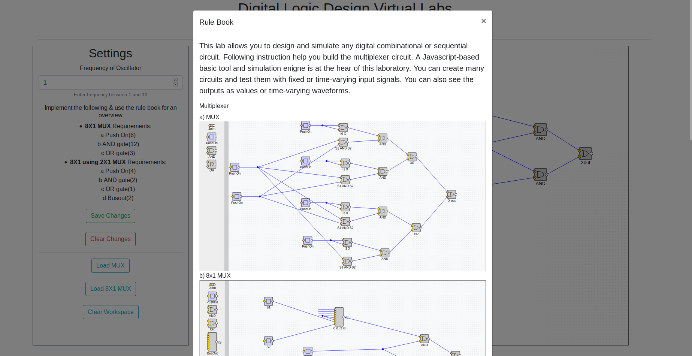
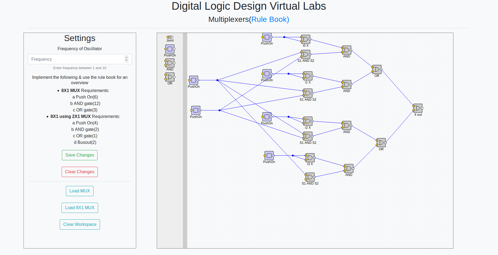
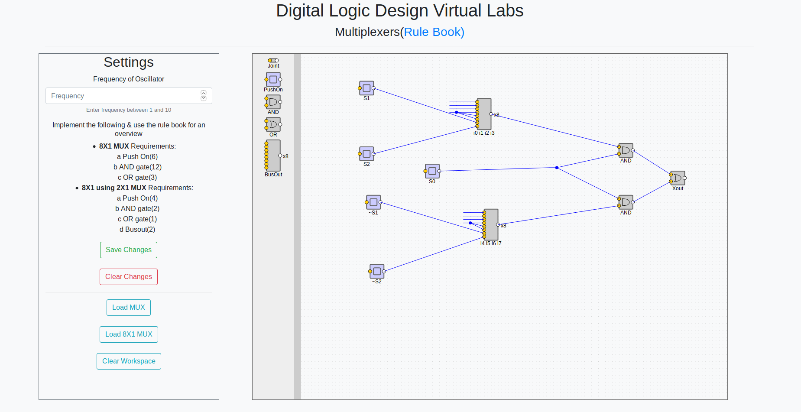

# Experiment Procedure Documentation
---
## Introduction
This document captures the instructions to run the simulation.

## Instructions
1. To start the experiment, open the "MainIndex.html" file.

2. To run the experiment, click on the corresponding buttons provided in the MainIndex.html page.

3.Click on the "Instructions" button for steps on installing required prerequisites to run the experiment.

4. After clicking the "Load MUX" it will load the multiplexer.

5. After clicking the "Load 8X1 MUX" it will load 8x1 multiplexer.

6. After clicking the "Clear Workspace" it will clear the workspace.

7. The frequency of the Oscillator can be altered between 1 to 10.

